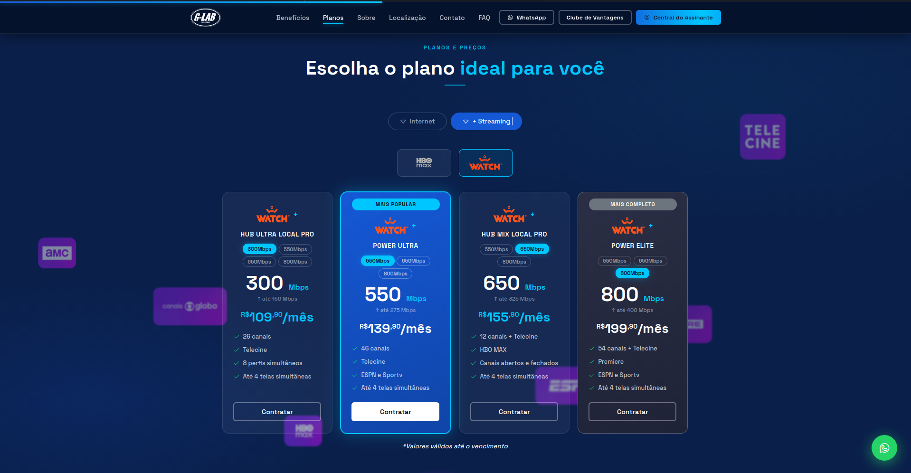
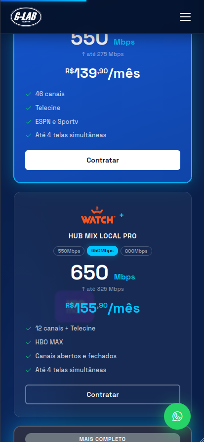

# G-Lab Telecom

<p align="center">
  
</p>

<p align="center">
  Landing page comercial para provedor de internet fibra óptica, construída com HTML5, CSS3 modular e JavaScript ES Modules puros, sem frameworks ou bundlers.
</p>

<p align="center">
  
  
  
  
</p>

---

## Visão Geral

O site da **G-Lab Telecom** é uma Landing Page Application desenvolvida sem frameworks ou etapas de build. Todo o código roda diretamente no navegador via módulos ES nativos, com deploy automático na Vercel a cada push no repositório.

O objetivo central é apresentar os planos de internet fibra óptica, converter visitantes em leads via WhatsApp e oferecer canais de atendimento acessíveis.

| -------------- | -------------------------------------------------------------------------------------------- |
| **Tipo** | Single Page Application (vanilla) |
| **Bundler** | Nenhum |
| **Hospedagem** | Vercel |
| **Requisitos** | Navegador moderno com suporte a ES Modules, CSS Custom Properties e IntersectionObserver API |

---

## Demonstração

| Desktop                                            | Mobile                                           |
| -------------------------------------------------- | ------------------------------------------------ |
|   |   |
|  |  |

---

## Funcionalidades

- **Typewriter** Alterna palavras em loop com efeito de digitação no título do hero.
- **Hero Slider** Troca automática de imagens com dots de navegação e pausa inteligente ao perder foco.
- **Canvas de fibra óptica** Animação de linhas em canvas 2D, pausada via `IntersectionObserver` quando fora do viewport.
- **Seletor de velocidade WatchBR** cada card de plano atualiza preço, upload e link do WhatsApp de forma independente.
- **Abas de planos** com sub-abas de streaming (Max / WatchBR).
- **FAQ Accordion** Acessível, com `aria-expanded` e `hidden`.
- **Scroll Reveal** Fade-in com `IntersectionObserver`, executado uma única vez por elemento.
- **Cursor personalizado** nom lerp suave via `requestAnimationFrame` (apenas em `pointer: fine`).
- **Efeito tilt 3D** nos cards de plano com brilho interno dinâmico.
- **Botões magnéticos** no hero, banner CTA e speed card.
- **Scroll Progress Bar** e **Scroll Spy** no menu de navegação.
- **Menu mobile** com animação em X, bloqueio de scroll e fechamento por Escape.

---

## Estrutura do Projeto

```
/
├── index.html                    # Ponto de entrada da aplicação
└── assets/
    ├── css/                      # 18 módulos de estilo
    │   ├── defaultStyles.css     # Reset, variáveis CSS, tipografia, container
    │   ├── defaultButtons.css    # Sistema de botões
    │   ├── topBar.css
    │   ├── header.css
    │   ├── mobileMenu.css
    │   ├── hero.css
    │   ├── benefits.css
    │   ├── bannerCta.css
    │   ├── plans.css
    │   ├── useCases.css
    │   ├── aboutUs.css
    │   ├── contact.css
    │   ├── faq.css
    │   ├── footer.css
    │   ├── buttonWhatsApp.css
    │   ├── reveal.css
    │   ├── cursor.css
    │   ├── scrollInProgress.css
    │   └── responsive.css        # Todos os media queries carregado por último
    ├── js/                       # 16 módulos JavaScript
    │   ├── main.js               # Entry point, importa e inicializa tudo
    │   ├── headerScroll.js
    │   ├── mobileMenu.js
    │   ├── scrollSpy.js
    │   ├── smoothScroll.js
    │   ├── scrollReveal.js
    │   ├── tabs.js
    │   ├── streamTabs.js
    │   ├── faq.js
    │   ├── watchbrSelector.js
    │   ├── enhancements.js
    │   ├── heroSlider.js
    │   ├── cursor.js
    │   ├── typewriter.js
    │   ├── tilt.js
    │   └── scrollProgress.js
    ├── images/                   # Fotos e imagens de fundo
    └── icons/                    # Logos e ícones (SVG/PNG)
```

---

## Design Tokens

Todas as variáveis globais estão em `assets/css/defaultStyles.css`. Alterar qualquer uma propaga a mudança automaticamente para todo o projeto.

```css
/* Cores principais */
--navy: #04122b /* Topbar, footer */ --navy-mid: #0a1f4a
  /* Hero, seção de planos */ --blue-mid: #1558d6
  /* Ação principal: botões, links ativos */ --cyan: #00c6ff
  /* Accent: destaques, ícones, bordas hover */ /* Animação */
  --ease: cubic-bezier(0.22, 1, 0.36, 1) --dur: 0.25s;
```

**Tipografia:** Space Grotesk (UI e títulos) · Sora (fallback) · Barlow (corpo em contextos específicos)

---

## Dependências Externas

Nenhuma dependência é gerenciada via `npm`. Tudo é carregado por CDN.

| Recurso               | URL                                   |
| --------------------- | ------------------------------------- |
| Google Fonts          | `fonts.googleapis.com`                |
| Phosphor Icons v2.1.1 | `unpkg.com/@phosphor-icons/web@2.1.1` |

---

## Arquitetura JavaScript

Todos os módulos seguem o mesmo contrato: exportam uma função `init*()` e são inicializados exclusivamente por `main.js` dentro do `DOMContentLoaded`. Nenhum módulo executa código no nível raiz do arquivo.

```
tabs.js       →  importa { observeReveal } de scrollReveal.js
streamTabs.js →  importa { observeReveal } de scrollReveal.js
```

Todos os demais módulos são independentes entre si.

---

## Manutenção de Conteúdo

| O que alterar             | Onde                                           |
| ------------------------- | ---------------------------------------------- |
| Número de WhatsApp        | `Ctrl+H` → buscar `5511948830455`              |
| Telefone de contato       | `Ctrl+H` → buscar `2500-3241`                  |
| Palavras do typewriter    | `assets/js/typewriter.js` → `WORDS[]`          |
| Preços dos planos WatchBR | `assets/js/watchbrSelector.js` → `WBR_PLANS`   |
| Imagens do slider do hero | `assets/js/heroSlider.js` → `SLIDES[]`         |
| Cores globais             | `assets/css/defaultStyles.css` → `:root`       |
| Planos de internet        | `index.html` → `#tab-internet > .planos__grid` |

> **Após qualquer alteração**, use `Ctrl+Shift+R` para forçar o navegador a recarregar sem cache.

---

## Adicionando Conteúdo

**Novo plano de internet**
Duplique qualquer `.plano-card` dentro de `#tab-internet > .planos__grid` e atualize velocidade, preço e o link do WhatsApp. O grid se ajusta automaticamente via `auto-fit`.

**Novo plano WatchBR**

1. Adicione uma chave em `WBR_PLANS` no `watchbrSelector.js`
2. Adicione o nome URL-encoded em `WBR_PLAN_NAMES`
3. Duplique um `.wbr-card` em `#grid-watchbr` com os atributos `data-plan` e `data-default-speed` corretos

**Nova pergunta no FAQ**
Duplique qualquer `.faq__item` dentro de `.faq__list`. O `faq.js` gerencia automaticamente todos os itens presentes no DOM.

**Novo módulo JS**

1. Crie `assets/js/nome-do-modulo.js` exportando `initNome()`
2. Importe e chame `initNome()` em `main.js` dentro do `DOMContentLoaded`

---

## Responsividade

Abordagem **desktop-first**. Todos os media queries ficam centralizados em `responsive.css`, que deve ser sempre o **último** arquivo carregado.

| Breakpoint | Principais ajustes                                             |
| ---------- | -------------------------------------------------------------- |
| `≤ 1024px` | Layout de benefícios em 1 coluna, footer em 2 colunas          |
| `≤ 900px`  | Nav oculta, hamburguer visível, grid de planos em coluna única |
| `≤ 768px`  | Hero empilhado, stats em grade 2×2                             |
| `≤ 480px`  | E-mail da topbar oculto, streaming tabs em coluna              |

---

## Performance e Acessibilidade

**Performance**

- `loading="lazy"` em todas as imagens abaixo do fold
- `rel="preconnect"` nas fontes do Google
- Script do Phosphor Icons com `defer`
- Scroll events registrados com `{ passive: true }`
- `IntersectionObserver` substitui scroll listeners custosos
- Canvas da fibra óptica pausa com `visibilitychange` e `IntersectionObserver`
- `unobserve()` após cada animação de reveal (executa uma única vez)

**Acessibilidade**

- `aria-label` em todos os botões sem texto visível
- `aria-expanded` nos botões do FAQ e hamburguer
- `aria-hidden` no menu mobile quando fechado
- `aria-selected` nas abas de planos e streaming
- `role="tablist/tab/tabpanel"` na seção de planos
- Atributo `hidden` semântico nas respostas do FAQ
- Contraste texto/fundo ≥ 7:1 (acima do WCAG AA)
- Cursor personalizado ativado apenas em `(pointer: fine)`

---

## Deploy

O projeto está hospedado na **Vercel**. Qualquer push na branch principal dispara um novo deploy automaticamente, sem etapas de build, sem configuração adicional.

---

## Créditos

Desenvolvido pela equipe G-Lab Telecom.  
Desenvolvimento principal por [@pedpalma](https://github.com/pedpalma).
